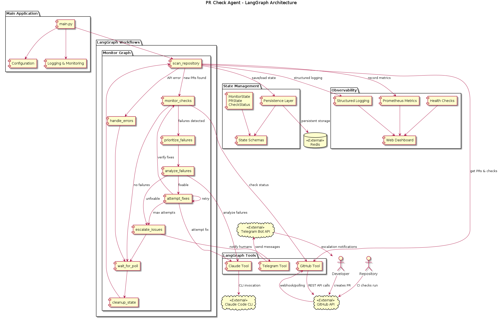
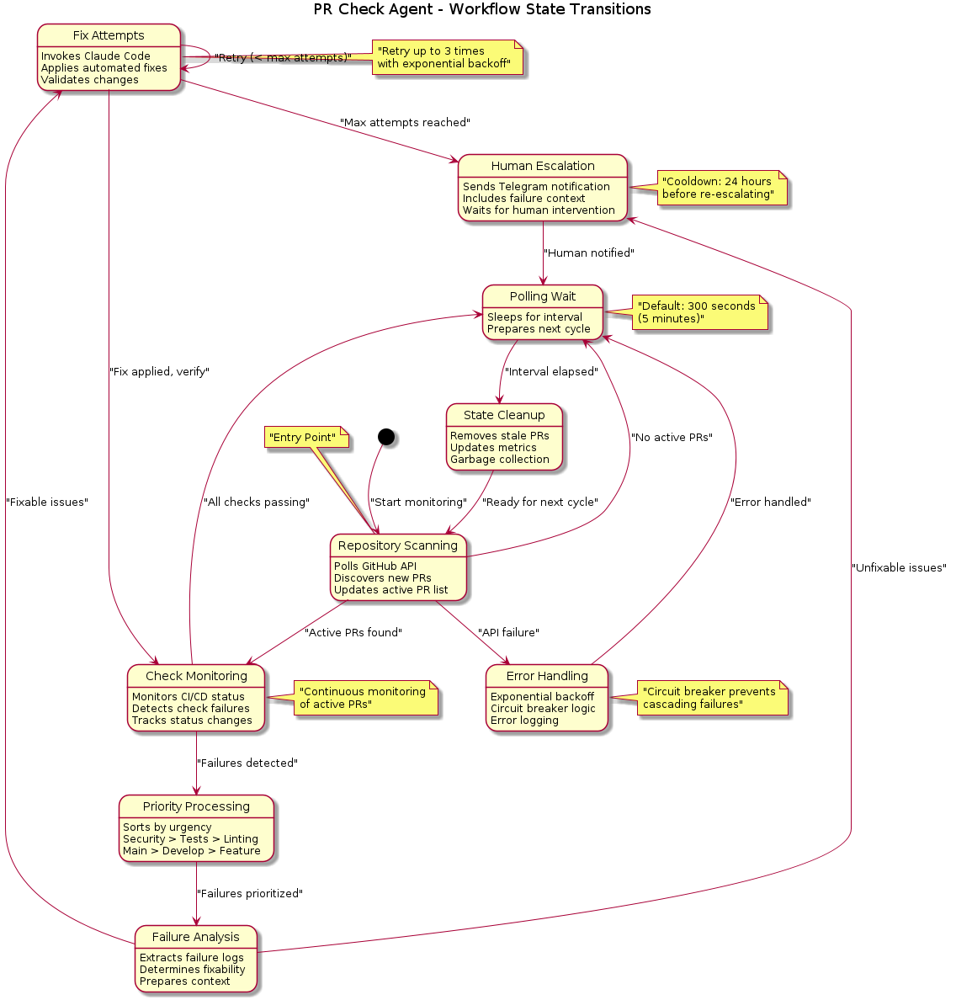

# PR Check Agent

A **LangGraph-powered** automated agent that monitors GitHub pull requests, detects failed checks, and invokes Claude Code with failure information for analysis and fixes.

[](https://github.com/feddericovonwernich/pr-checks-agent/actions/workflows/ci.yml)
[](https://github.com/feddericovonwernich/pr-checks-agent/actions/workflows/deploy.yml)

## 🚀 Quick Start

### Prerequisites
- Python 3.13+
- Redis (for state persistence)
- GitHub personal access token
- **Claude Code CLI**: Install from [Claude Code documentation](https://docs.anthropic.com/en/docs/claude-code)
- **LLM Provider API Key**: Choose from OpenAI, Anthropic, or Ollama for decision-making (powered by **LangChain**)
- **Anthropic API key** (for Claude Code analysis and repository fixes)
- Telegram bot token (for notifications)

### Installation

1. **Clone and setup:**
   ```bash
   git clone https://github.com/feddericovonwernich/pr-checks-agent.git
   cd pr-checks-agent
   chmod +x scripts/setup.sh
   ./scripts/setup.sh
   ```

2. **Configure environment:**
   ```bash
   cp .env.example .env
   # Edit .env with your API keys and settings
   ```

3. **Configure repositories:**
   ```bash
   # Edit config/repos.json with your repositories to monitor
   ```

4. **Run the agent:**
   ```bash
   source venv/bin/activate
   python src/main.py
   ```

### Docker Setup

```bash
# Copy environment file
cp .env.example .env
# Edit .env with your configuration

# Start with Docker Compose
docker-compose up -d
```

## 🏗️ Architecture

This agent uses **LangGraph** to implement sophisticated workflows for:

- **Repository Monitoring**: Continuous polling of GitHub PRs and check statuses
- **Intelligent Analysis**: Configurable LLM providers (OpenAI, Anthropic, Ollama) for failure analysis
- **Automated Fixes**: Hybrid Claude integration (LangChain API for analysis + Claude Code CLI for actual repository changes)
- **Smart Escalation**: LLM-powered escalation decisions with human notifications
- **State Management**: Persistent workflow state across restarts

### System Architecture



The system is built around a **LangGraph workflow** that coordinates between multiple components:
- **External Services**: GitHub API, Claude Code CLI, Telegram Bot API, Redis
- **LangGraph Tools**: Modular tools for API interactions
- **State Management**: Persistent state with Redis backend
- **Observability**: Built-in metrics, health checks, and dashboard

### Workflow State Machine



The workflow implements a state machine with these key transitions:
1. **Repository Scanning** → Discovers PRs and check status changes
2. **Check Monitoring** → Detects failures and triggers analysis
3. **Priority Processing** → Sorts failures by urgency (security > tests > linting)
4. **Failure Analysis** → Configurable LLM analyzes failures and determines fixability
5. **Fix Attempts** → Claude Code performs actual repository changes (up to 3 attempts)  
6. **Smart Escalation** → LLM decides when human intervention is needed
7. **Polling Wait** → Sleeps between monitoring cycles (default: 5 minutes)

### Core Components

- **LangGraph Workflows**: Separate graphs for monitoring, PR processing, fix attempts, and escalation
- **Smart Retry Logic**: Configurable attempt limits with exponential backoff
- **Priority System**: Intelligent ordering based on check types and branch importance
- **Custom Observability**: Built-in metrics, tracing, and web dashboard

## 📊 Features

- ✅ **Multi-Repository Support**: Monitor multiple repositories simultaneously
- ✅ **Priority-Based Processing**: Handle critical checks (security, tests) first
- ✅ **LangChain Integration**: Unified LLM interface with structured outputs and better error handling
- ✅ **Multi-LLM Support**: Choose from OpenAI, Anthropic Claude, or Ollama providers
- ✅ **Rate Limiting**: Respect GitHub API and Claude Code usage limits
- ✅ **Human-in-the-Loop**: Telegram escalation when automation fails
- ✅ **Custom Observability**: Prometheus metrics and real-time dashboard
- ✅ **Fault Tolerance**: Circuit breakers and graceful degradation
- ✅ **Secure**: Environment-based secrets, input validation, audit logging

## 🔧 Configuration

### Environment Variables

| Variable | Description | Default |
|----------|-------------|---------|
| `GITHUB_TOKEN` | GitHub personal access token | Required |
| `ANTHROPIC_API_KEY` | Claude Code API key (for analysis and fixes) | Required |
| **LLM Provider Configuration** | | |
| `LLM_PROVIDER` | LLM provider: `openai`, `anthropic`, or `ollama` | `openai` |
| `OPENAI_API_KEY` | OpenAI API key (if using OpenAI provider) | Optional |
| `LLM_MODEL` | Model name (e.g., `gpt-4`, `claude-3-5-sonnet-20241022`, `llama3.2`) | Provider default |
| `LLM_BASE_URL` | Custom base URL (for Ollama: `http://localhost:11434`) | Optional |
| **Telegram Configuration** | | |
| `TELEGRAM_BOT_TOKEN` | Telegram bot token | Required |
| `TELEGRAM_CHAT_ID` | Telegram chat/channel ID | Required |
| **System Configuration** | | |
| `REDIS_URL` | Redis connection string | `redis://localhost:6379/0` |
| `POLLING_INTERVAL` | Seconds between polling cycles | `300` |
| `MAX_FIX_ATTEMPTS` | Max Claude Code attempts per check | `3` |
| `ESCALATION_COOLDOWN` | Hours between repeated escalations | `24` |

### LLM Provider Configuration

The agent uses **two separate LLM systems** with distinct roles:

#### 🎯 **Decision-Making LLM** (Configurable)
- **Purpose**: Analyzes failures and makes escalation decisions
- **Providers**: OpenAI, Anthropic, or Ollama
- **Configuration**: Environment variables or config file

#### 🔧 **Claude Code Integration** (Hybrid)
- **Analysis**: LangChain Anthropic API for structured failure analysis
- **Fixing**: Claude Code CLI for complete fix workflow:
  - Makes code changes
  - Runs tests to verify fixes
  - Commits changes with descriptive messages
  - Pushes to PR branch
  - Adds explanatory PR comments
- **Configuration**: `ANTHROPIC_API_KEY` + local repository paths

#### Provider Examples

**OpenAI (Default)**:
```bash
export LLM_PROVIDER="openai"
export LLM_MODEL="gpt-4"
export OPENAI_API_KEY="sk-..."
```

**Anthropic**:
```bash
export LLM_PROVIDER="anthropic"  
export LLM_MODEL="claude-3-5-sonnet-20241022"
export ANTHROPIC_API_KEY="sk-ant-..."  # Used for both decision-making and fixes
```

**Ollama (Local)**:
```bash
export LLM_PROVIDER="ollama"
export LLM_MODEL="llama3.2"
export LLM_BASE_URL="http://localhost:11434"
export ANTHROPIC_API_KEY="sk-ant-..."  # Still required for Claude Code fixes
```

### Repository Configuration

Edit `config/repos.json` to specify which repositories to monitor:

```json
{
  "repositories": [
    {
      "owner": "your-org",
      "repo": "your-repo",
      "repository_path": "/path/to/local/your-repo",
      "branch_filter": ["main", "develop"], 
      "check_types": ["ci", "tests", "linting"],
      "claude_context": {
        "language": "python",
        "framework": "fastapi",
        "test_framework": "pytest"
      },
      "priorities": {
        "check_types": {
          "security": 1,
          "tests": 2,
          "linting": 3
        }
      }
    }
  ],
  "llm": {
    "provider": "openai",
    "model": "gpt-4",
    "temperature": 0.1,
    "max_tokens": 2048
  }
}
```

### 📁 Local Repository Setup

For Claude Code CLI to make actual changes, each monitored repository must be available locally:

**Required Configuration:**
- Set `repository_path` in `config/repos.json` to the local clone path
- Ensure repositories are kept up-to-date (the agent doesn't auto-pull)
- Make sure the agent process has write access to repository directories

**Example Setup:**
```bash
# Clone your repositories locally
git clone https://github.com/your-org/repo1.git /home/user/repos/repo1
git clone https://github.com/your-org/repo2.git /home/user/repos/repo2

# Configure paths in repos.json
"repositories": [
  {
    "owner": "your-org",
    "repo": "repo1", 
    "repository_path": "/home/user/repos/repo1",
    ...
  }
]
```

**Important Notes:**
- The agent will make direct file changes via Claude Code CLI
- Always run on a dedicated branch or ensure proper backup/recovery procedures
- Consider running with `dry_run: true` initially to test configuration

## 🏥 Monitoring & Health

### Health Checks
```bash
# Basic health check
./scripts/health-check.sh

# Detailed system information
./scripts/health-check.sh --detailed

# Via HTTP
curl http://localhost:8080/health
```

### Metrics & Dashboard
- **Prometheus metrics**: `http://localhost:8080/metrics`
- **Built-in dashboard**: `http://localhost:8080/dashboard`
- **Health endpoint**: `http://localhost:8080/health`

### Backup & Recovery
```bash
# Backup Redis state
./scripts/backup.sh

# Backups are stored in ./backups/ with automatic cleanup
```

## 🧪 Development

### Running Tests
```bash
# Install test dependencies
pip install -r requirements.txt

# Run tests
pytest tests/ -v

# Run with coverage
pytest tests/ --cov=src --cov-report=html
```

### Code Quality
```bash
# Linting and formatting with Ruff
ruff check src/ tests/
ruff format src/ tests/

# Type checking  
mypy src/
```

### LangGraph Development
```bash
# Visualize workflows
langgraph draw src/graphs/monitor_graph.py --output monitor_graph.png

# Run with tracing
python src/main.py --trace --dashboard
```

## 🔧 Troubleshooting

### Debug Logging

The agent includes comprehensive debug logging with emoji tags for easy filtering:

```bash
# Enable debug logging
export LOG_LEVEL=DEBUG
python src/main.py --dev

# View analyzer workflow
grep "🔍\|🤖\|📊\|✅\|❌" logs/pr-agent.log

# Check LLM interactions  
grep "🤖\|📤\|📥" logs/pr-agent.log

# Monitor GitHub API calls
grep "🔗\|📞\|📝" logs/pr-agent.log
```

### Common Issues

**Issue: No failures detected**
```bash
# Check GitHub API connectivity and permissions
grep "GitHub.*error\|403\|401" logs/pr-agent.log
```

**Issue: Analysis failing**  
```bash
# Check LLM provider connectivity
grep "LLM.*error\|❌.*Analysis" logs/pr-agent.log
```

**Issue: Fixes not being attempted**
```bash  
# Check fixability decisions
grep "🤔\|📊\|Decision" logs/pr-agent.log
```

For comprehensive troubleshooting guides and detailed debug logging documentation, see **[DEV.md](./DEV.md#debug-logging)**.

## 🚢 Deployment

### Production Considerations
- **High Availability**: Deploy multiple instances with Redis clustering
- **Resource Limits**: Configure appropriate memory and CPU constraints
- **Network Security**: Use VPN access for sensitive endpoints
- **Log Management**: Implement log rotation and centralized collection
- **Monitoring**: Set up alerting on health endpoints and metrics

### Scaling
- **Horizontal Scaling**: Multiple agent instances with Redis coordination
- **Repository Partitioning**: Distribute repositories across instances
- **Load Balancing**: Dynamic workflow distribution based on queue depth

## 📚 Documentation

- [`CLAUDE.md`](./CLAUDE.md) - Detailed technical documentation and architecture
- [`docs/LANGCHAIN_INTEGRATION.md`](./docs/LANGCHAIN_INTEGRATION.md) - LangChain integration guide and migration
- [`docs/diagrams/`](./docs/diagrams/) - Architecture diagrams and PlantUML sources
- [GitHub Issues](https://github.com/feddericovonwernich/pr-checks-agent/issues) - Issue tracking and support

## 🤝 Contributing

1. Fork the repository
2. Create a feature branch: `git checkout -b feature/amazing-feature`
3. Make your changes and add tests
4. Run the test suite: `pytest tests/`
5. Commit your changes: `git commit -m 'Add amazing feature'`
6. Push to the branch: `git push origin feature/amazing-feature`
7. Open a Pull Request

## 📄 License

This project is licensed under the MIT License - see the [LICENSE](LICENSE) file for details.

## 🙏 Acknowledgments

- **LangGraph** - Powerful workflow framework for AI agents
- **Claude Code** - AI-powered code analysis and fixing
- **GitHub API** - Repository and check status integration
- **Telegram Bot API** - Human escalation notifications